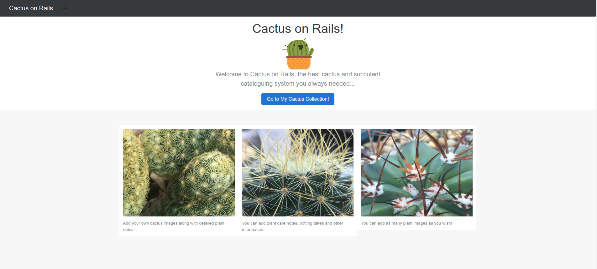
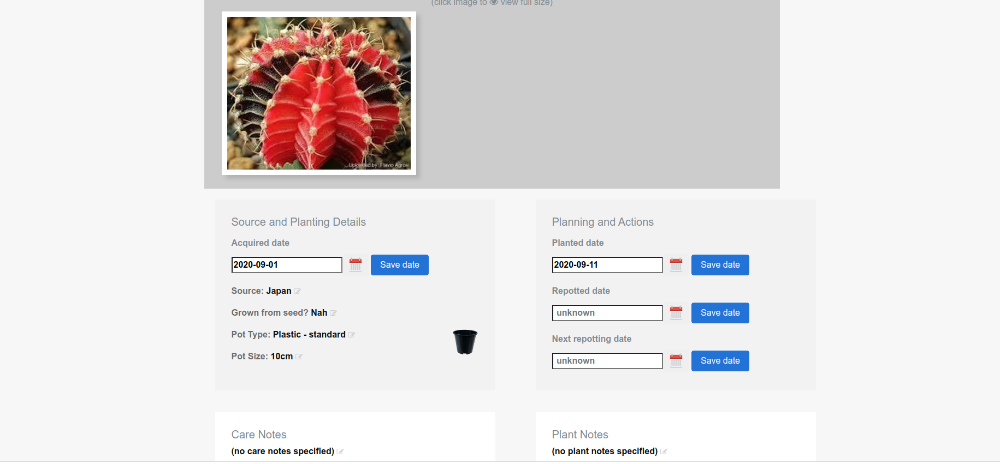
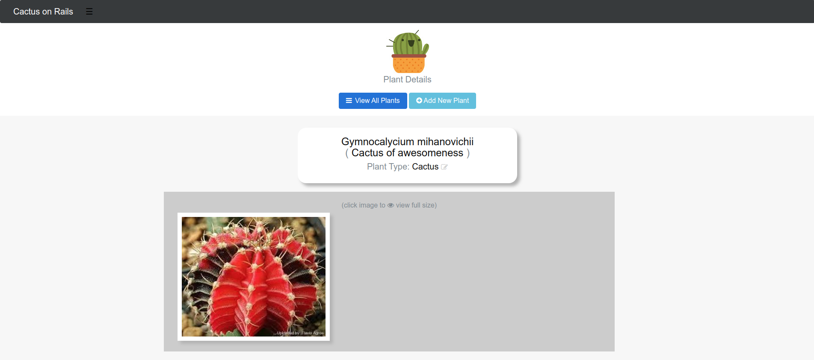
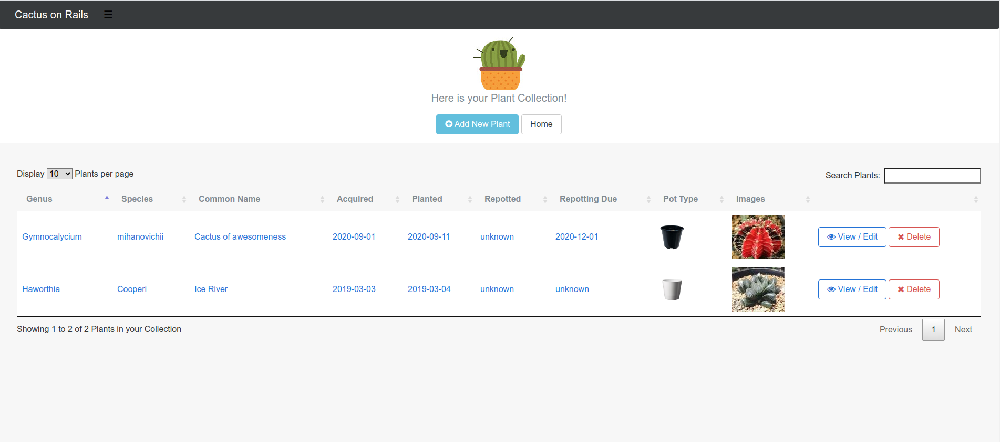

# CACTUS ON RAILS

The only cactus and succulent database you'll ever need.

Installation and deployment notes:

* Ruby 2.2 required, MySqlite3 required, built in Rails 5

* Ruby / Rails installation - on windows use the Ruby Installer / Rails installer (will install git and mysqlite3 if required), see http://railsinstaller.org/en
* or use your preferred OS-specific solution
* then gem install bundler
* then gem install rails

* NodeJs required - use the NodeJs installer and restart machine, see https://nodejs.org/en/download/

* Note application originally developed under Windows; most instructions related to Windows environment & not yet updated for Linux

* Image manipulation requires the installation of ImageMagick, to enable CarrierWave to work.
for windows see https://sourceforge.net/projects/imagemagick/files/latest/download?source=files
During installation, ensure that path setting option and C libs options are selected. Install to C:\ImageMagick.
After installation of ImageMagick, open a console and run the following:
 set CPATH=C:\ImageMagick\include
 set LIBRARY_PATH=C:\ImageMagick\lib
- both needed to set the paths for ImageMagick correctly.
Then gem install mini_magick (below in bundle install) will take care of it
Then all should work, as carrierwave is configured to use mini_magick for image processing.

* run bundle install

* Database creation - run ruby bin/rails db:schema:load or ruby bin/rails db:migrate 

* Assets precompile - may be required to do rake assets:precompile for datatables images

* Deployment instructions - rails server and access at localhost:3000

* Demo app only; no auth, designed to run as single-machine local instance.

